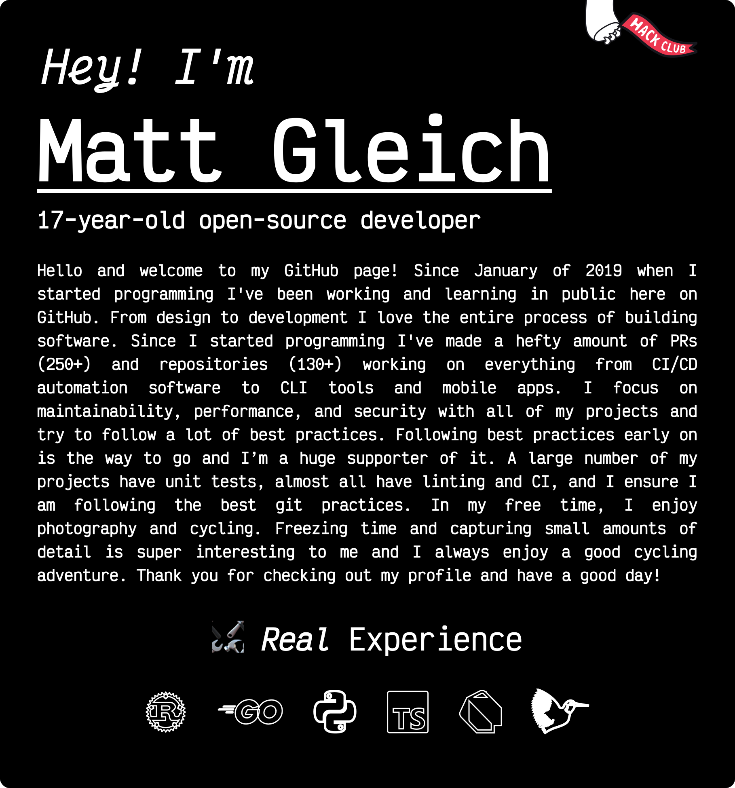

     
    

<!-- START OF PROFILE STACK, DO NOT REMOVE -->
| 💻 **Technology** | 🚀 **Projects** |
| - | - |
|  |                     |
|  |          |
|  |    |
|  |    |
|  |        [&color=000605&logo=github&logoColor=FFFFFF&labelColor=000605)](https://github.com/gleich/clueprog) [&color=000605&logo=github&logoColor=FFFFFF&labelColor=000605)](https://github.com/gleich/wakavis) |
|  |      |
|  |      |
|  |   |
|  |      |
|  |  |
|  |    |
<!-- END OF PROFILE STACK, DO NOT REMOVE -->

    <i>Not including Private Repositories</i>

